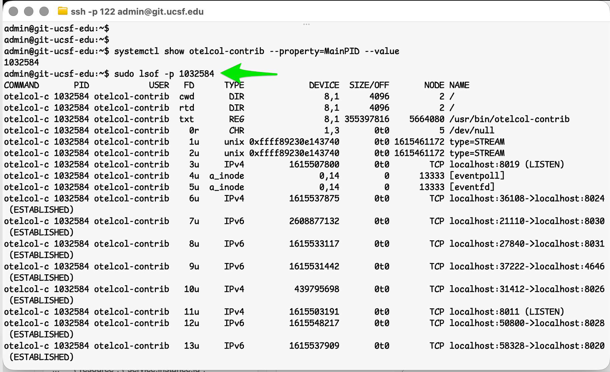
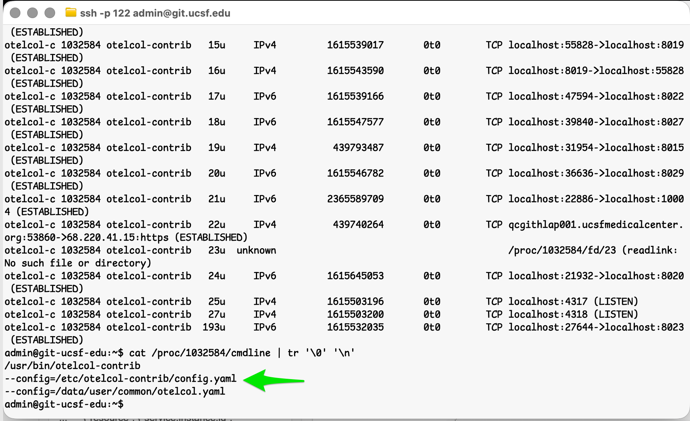
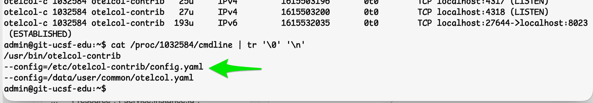

# Congratulations, You're the Integration Layer Now

### OpenTelemetry in the UC Stack

### Hardy Pottinger | UC Tech 2026

Note:
Hi. I'm Hardy Pottinger. I work on the Developer Experience team at UCSF.

This talk is not an OpenTelemetry tutorial. I'm going to assume you've heard
the name. Some of you have used it. Some of you are actively avoiding it.
Many of you are about to be responsible for it whether you planned to be or not.

This is the warning I wish someone had given me before I spent a week on a
problem that took one 4am maintenance window to solve — once I understood what was
actually happening.

---

# I Just Wanted One Metric

In Datadog.

Note:
I had one observability task: get GitHub Enterprise metrics into Datadog.

I manage GitHub Enterprise Server at UCSF. We have Datadog. GitHub had
just added OpenTelemetry support. The docs existed. This seemed like a
nice quick maintenance window project. Turn on the thing, look at the thing, bask in glory.

I was wrong.

---

# OpenTelemetry Isn't New.

I was.

Note:
Most people in this room have heard of OpenTelemetry. Some have experimented
with it. I ignored it because vendors handled observability for me. The agent
took care of it. The integration took care of it. I didn't have to think about
the pipeline.

Quick note: everyone in observability calls it OTel. I'll use both from here on, but please don't zing me on Jargon if I say OTel, becuase that's what everyone calls it.

That was fine. Until it wasn't.

---

# What Changed?

The industry.

> "Early mainstream" — Gartner

> "Supported by more than 40 observability vendors" — CAMSS, 2024

Note:
The organizers told us this isn't a scientific conference, WeI don't need receipts.

But I have receipts. Gartner calls OTel "early mainstream," with 20 to 50 percent
market penetration. The European Commission's CAMSS assessment found OTel
supported by more than 40 observability vendors.

The point is: the industry has changed. This isn't a side project anymore.
This is how it's done.

---

# The Promise of OpenTelemetry

> Instrument once.
>
> Analyze anywhere.

Note:
This is a real achievement. If you've ever had to re-instrument an application
because you switched vendors, you know exactly how painful that used to be.
OpenTelemetry solved that. Instrument once, analyze anywhere. That's worth
celebrating.

But every promise has fine print.

---

# I Thought...

"This is just another integration."

Note:
Point GitHub at Datadog. Configure the collector. Collect metrics. Move on.
I had a Jira ticket, a 4am maintenance window, and what I thought was a
straightforward integration task.

I walked into it completely blind. This confidence was entirely unearned.

---

Note:
This. That's it. GitHub Enterprise system metrics, flowing into Datadog.
Nothing exotic. Just a dashboard with data in it.

---

# The Metric Never Appeared.

Note:
I configured the integration. I waited. I refreshed. Nothing. Not an error.
Not a partial result. Just nothing. An empty space where metrics should be.

OK. I probably made a typo. I re-read the documentation. I re-configured.
I waited again.

---

# So I Changed the Config.

Nothing happened.

Note:
I changed the configuration. Restarted the collector. Waited. Nothing.
Changed it again. Restarted. Nothing. I went back to the docs. Read them
more carefully. Tried again. Still nothing.

Edit. Restart. Wait. Nothing. Edit. Restart. Wait. Nothing.

---

# Maybe...

I'm Editing The Wrong Config?

Note:
This is the question that changed everything. Not "what's wrong with my
config?" but "am I even editing the right file?"

When you've been editing and restarting and nothing changes, the hunch
"wrong file" gets very compelling. So I stopped reading the documentation
and started reading the running system.

---

# `lsof`

s
Note:
I had a hunch: what if there's another config file the Collector
is reading that I don't know about? `lsof -p <pid>` shows every open
file for a process. If my config wasn't the only one, it would show up here.

Except it didn't. lsof showed me sockets, connections, the binary —
but no config files. Go processes read config at startup and close the
file descriptors immediately. The config is in memory by the time you
look. Dead end. Try something else.

---

# Read the Running System

Note:
Every Linux process has a /proc entry. /proc/process-id/cmdline contains
the exact command line the process was started with — every flag,
every argument. The `tr` command makes it readable by replacing null
bytes with newlines. This is a good trick, I kinda love it. And look at what we found...

---

# ...Oh, Cursewords.

two config files

Note:
Two --config files.

/etc/otelcol-contrib/config.yaml — GitHub's default, shipped with GHES.
/data/user/common/otelcol.yaml — mine. My config.

I had been editing my config the whole time without knowing it was an *overlay*: there was
a base config underneath it. A config I had never seen. A config that
was quietly overriding everything I thought I was doing.

---

# The Docs Weren't Wrong.

They weren't complete.

Note:
The GitHub docs told me exactly what to put in my config file.
They were accurate. They just didn't mention that the Collector
was already running with a base config underneath mine.

That's not a documentation bug. It's a documentation gap. The
vendor documented their overlay. They didn't document the whole
stack. And if you don't know the stack has layers, the docs
look complete when they aren't.

This isn't even unusual. Web developers expect a config file to be
the whole story. Observability engineers know to ask: what is the
Collector already doing? I just didn't know which mindset I needed yet.

---

# This Is The Design.

Note:
- Composability.
- Layering.
- Vendor neutrality.
- Explain why this architecture exists.

---

# Suddenly...

Everything Made Sense.

Note:
- Same afternoon everything clicked.
- Mental model changed.
- Configuration started behaving predictably.

---

Note:
There it is.

---

# I Finally Understood

OpenTelemetry wasn't solving my problem.

It was solving interoperability.

Note:
- My goal: metrics.
- OTel's goal: interoperability.
- Those overlap, but they're different.

---

# The Old World

Application

↓

Vendor Agent

↓

Vendor Backend

Note:
- Tight coupling.
- Vendor-owned integration.

---

# The New World

Application

↓

OpenTelemetry

↓

Collector

↓

Backend(s)

Note:
- Decoupled architecture.
- Somebody owns the middle.

---

# Congratulations.

You're the Integration Layer Now.

Note:
- The thesis.
- Nobody assigned this responsibility.
- It's an architectural consequence.

---

# Suddenly We Owned...

- Endpoints
- Collectors
- Routing
- Authentication
- Certificates
- Configuration

Note:
- Not a complaint.
- Just reality.

---

# Configuration Is Architecture

Note:
- Collector YAML isn't "settings."
- It encodes operational decisions.
- Read it as infrastructure.

---

# Reading Collector Configs

Ask better questions.

Note:
- Which distribution?
- Which defaults?
- Which overlay?
- Which deployment?
- Which runtime?

---

# Practical Detective Work

Note:
- Finding the running config.
- Looking for overlays.
- Understanding effective configuration.
- Reading vendor examples critically.

---

# The GitHub Story

Note:
- Walk through the implementation.
- Focus on discoveries.
- Not every implementation detail.
- Emphasize the learning process.

---

# What I'd Do Differently

Note:
- Understand the layering first.
- Find the effective config first.
- Learn the Collector's objective before editing YAML.

---

# What Platform Teams Should Do

- Decide ownership.
- Treat config as code.
- Standardize patterns.
- Start small.

Note:
**Decide ownership.**
Who runs the Collector? If it's a shared platform Collector
(daemonset, sidecar, or gateway), the platform team owns the
pipeline and the config. If each app team runs their own, they
own the config but the platform team should provide the base
template. The worst outcome is nobody owning it — that's how
drift happens.

**Treat config as code.**
Put your Collector configs in Git. Use a minimal GitOps flow:
- PR changes to a `collector-configs/` repo.
- A CI check runs `otelcol --dry-run --config <file>` to validate
  YAML syntax and pipeline topology.
- Merge to main deploys via Ansible, Helm, or a simple rsync.
This catches typos before they cause silent failures.

**Standardize patterns.**
Define a small set of approved pipeline templates:
- Standard receiver patterns (OTLP, host metrics, filelog).
- Common processor chains (batch, memory limiter, attributes).
- One exporter per backend (Datadog, Prometheus, etc.).
Deviation from template requires justification. This keeps the
support surface manageable.

**Start small.**
One Collector. One integration. Prove the pipeline end-to-end
before scaling. A single working path — GitHub → Collector →
Datadog — teaches you more about the architecture than a dozen
configs that mostly work. Build confidence, then generalize.

---

# The Warning

OpenTelemetry succeeded.

Now you own part of the pipeline.

Note:
- This is not a vendor problem.
- This is the consequence of vendor-neutral architecture.
- Better to understand it now than discover it accidentally.

---

# Takeaways

- OpenTelemetry optimizes for interoperability.
- The Collector is infrastructure.
- Layering is intentional.
- Learn the mental model first.
- This week of confusion can become one afternoon.

---

# Questions?
