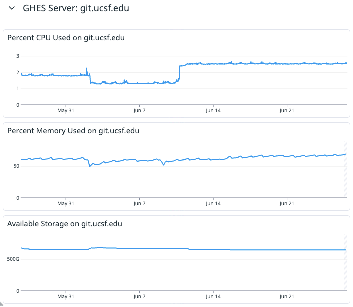

# Congratulations, You're the Integration Layer Now

### OpenTelemetry in the UC Stack

### UC Tech 2026

Note:
Hi. I'm Hardy Pottinger. I work on the Developer Experience team at UCSF.

This talk is not an OpenTelemetry tutorial. I'm going to assume you've heard
the name. Some of you have used it. Some of you are actively avoiding it.
Many of you are about to be responsible for it whether you planned to be or not.

This is the warning I wish someone had given me before I spent a week on a
problem that took one afternoon to solve — once I understood what was
actually happening.

---

# I Just Wanted One Metric

In Datadog.

Note:
I had one observability task: get GitHub Enterprise metrics into Datadog.

We had GitHub Enterprise Server running at UCSF. We had Datadog. GitHub had
just added OpenTelemetry support. The docs existed. This seemed like a
Tuesday afternoon project.

I was wrong.

---

# OpenTelemetry Isn't New.

We are.

Note:
Most people in this room have heard of OpenTelemetry. Some have experimented
with it. I ignored it because vendors handled observability for me. The agent
took care of it. The integration took care of it. I didn't have to think about
the pipeline.

Quick note: everyone in the field calls it OTel. I'll use both from here on.

That was fine. Until it wasn't.

---

# What Changed?

The industry.

> "Early mainstream" — Gartner

> "Supported by more than 40 observability vendors" — CAMSS, 2024

Note:
They told me this isn't a scientific conference, I don't need receipts.

But I have receipts. Gartner calls it early mainstream, with 20 to 50 percent
market penetration. The European Commission's CAMSS assessment found it
supported by more than 40 observability vendors.

The point is: the industry has changed. This isn't a niche project anymore.
This is infrastructure.

---

# The Promise of OpenTelemetry

> Instrument once.
>
> Analyze anywhere.

Note:
This is a real achievement. If you've ever had to re-instrument an application
because you switched vendors, you know exactly how painful that used to be.
OpenTelemetry solved that. Instrument once, analyze anywhere. That's worth
celebrating.

But every promise has fine print.

---

# I Thought...

"This is just another integration."

Note:
Point GitHub at Datadog. Configure the collector. Collect metrics. Move on.
I had a Jira ticket, a 4am maintenance window, and what I thought was a
straightforward integration task.

I walked into it completely blind. This confidence was entirely unearned.

---

# I Just Wanted This.

Note:
This. That's it. GitHub Enterprise system metrics, flowing into Datadog.
Nothing exotic. Just a dashboard with data in it.

---

# The Metric Never Appeared.

Note:
I configured the integration. I waited. I refreshed. Nothing. Not an error.
Not a partial result. Just nothing. An empty graph where metrics should be.

OK. I probably made a typo. I re-read the documentation. I re-configured.
I waited again.

---

# So I Changed the Config.

Nothing happened.

Note:
I changed the configuration. Restarted the collector. Waited. Nothing.
Changed it again. Restarted. Nothing. I went back to the docs. Read them
more carefully. Tried again. Still nothing.

Edit. Restart. Wait. Nothing. Edit. Restart. Wait. Nothing.

---

# Maybe...

I'm Editing The Wrong Config?

Note:
This is the question that changed everything. Not "what's wrong with my
config?" but "am I even editing the right file?"

When you've been editing and restarting and nothing changes, the hypothesis
"wrong file" gets very compelling. So I stopped reading the documentation
and started reading the running system.

---

# `lsof`

Note:
- Find the Collector process.
- Inspect open files.
- Discover additional configuration.

---

# ...Oh, Cursewords.

Note:
- Documented config was an overlay.
- There were other configuration layers.
- Immediate realization.

---

# The Docs Weren't Wrong.

They weren't complete.

Note:
- Vendor documented their opinion.
- Collector already had defaults.
- Overlay model is intentional.

---

# This Is The Design.

Note:
- Composability.
- Layering.
- Vendor neutrality.
- Explain why this architecture exists.

---

# Suddenly...

Everything Made Sense.

Note:
- Same afternoon everything clicked.
- Mental model changed.
- Configuration started behaving predictably.

---

# I Finally Understood

OpenTelemetry wasn't solving my problem.

It was solving interoperability.

Note:
- My goal: metrics.
- OTel's goal: interoperability.
- Those overlap, but they're different.

---

# The Old World

Application

↓

Vendor Agent

↓

Vendor Backend

Note:
- Tight coupling.
- Vendor-owned integration.

---

# The New World

Application

↓

OpenTelemetry

↓

Collector

↓

Backend(s)

Note:
- Decoupled architecture.
- Somebody owns the middle.

---

# Congratulations.

You're the Integration Layer Now.

Note:
- The thesis.
- Nobody assigned this responsibility.
- It's an architectural consequence.

---

# Suddenly We Owned...

- Endpoints
- Collectors
- Routing
- Authentication
- Certificates
- Configuration

Note:
- Not a complaint.
- Just reality.

---

# Configuration Is Architecture

Note:
- Collector YAML isn't "settings."
- It encodes operational decisions.
- Read it as infrastructure.

---

# Reading Collector Configs

Ask better questions.

Note:
- Which distribution?
- Which defaults?
- Which overlay?
- Which deployment?
- Which runtime?

---

# Practical Detective Work

Note:
- Finding the running config.
- Looking for overlays.
- Understanding effective configuration.
- Reading vendor examples critically.

---

# The GitHub Story

Note:
- Walk through the implementation.
- Focus on discoveries.
- Not every implementation detail.
- Emphasize the learning process.

---

# What I'd Do Differently

Note:
- Understand the layering first.
- Find the effective config first.
- Learn the Collector's objective before editing YAML.

---

# What Platform Teams Should Do

- Decide ownership.
- Treat config as code.
- Standardize patterns.
- Start small.

Note:
- One Collector.
- One integration.
- Build confidence.

---

# The Warning

OpenTelemetry succeeded.

Now you own part of the pipeline.

Note:
- This is not a vendor problem.
- This is the consequence of vendor-neutral architecture.
- Better to understand it now than discover it accidentally.

---

# Takeaways

- OpenTelemetry optimizes for interoperability.
- The Collector is infrastructure.
- Layering is intentional.
- Learn the mental model first.
- This week of confusion can become one afternoon.

---

# Questions?
